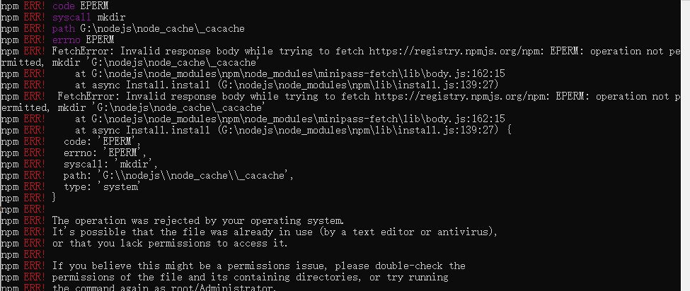
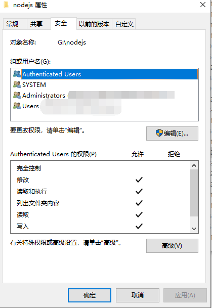
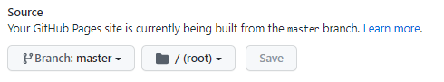
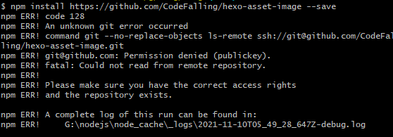

博客按照[从零开始搭建个人博客（超详细）](https://zhuanlan.zhihu.com/p/102592286)的步骤搭建。在搭建个人主页时，遇到了各种小问题，主要有webpack安装报错、hexo d不更新、图片不显示。这里记录自己的解决方法。

<!--more-->

## npm install webpack -g报错

在安装webpack时发生报错：



这是因为需要管理员权限，可以直接以管理员身份运行cmd。我是直接将右键文件夹，更改权限，也可以解决问题。



然后就可以成功安装啦！


## hexo d不更新

选择好主题后发现使用hexo d网页并没有更新到新的主题和内容。

原因是分支设定，原教程里设定为master：

``` bash
deploy:
  type: git
  repository: https://github.com/yoooopotato/yoooopotato.github.io.git  #你的仓库地址
  branch: master
```

在网上搜索了一翻，猜测设为master的原因是之前github的主分支就是master，但是现在改为main了。

为了方便以后更换电脑也能用，我继续使用master分支来做为存储博客页面的信息，使用main分支来储存搭建的代码。这就需要更改分支：



然后再进行hexo d，可能不会立刻更新，需要等一会。总之解决了。


## 图片不显示

搜索了一圈网上的教程，但对我并不完全适用。

### 修改配置_config.yml

将主文件夹中_config.yml里面的post_asset_folder:false这个选项设置为true。

### 安装插件hexo-asset-image

依据网上教程，直接npm install hexo-asset-image --save是无效的，需要进一步修改，但是安装教程[hexo使用markdown图片无法显示问题](https://www.jianshu.com/p/3db6a61d3782)操作依然不能成功显示，可能是修改位置不对。

尝试直接使用npm install https://github.com/7ym0n/hexo-asset-image --save安装修改插件，报错：



说是An unknown git error occurred，猜测可能是网站设成了read-only？因为hexo-asset-image可以成功安装，应该不是网的问题。

解决方法是直接用修改后的代码覆盖原先的代码，成功解决问题。