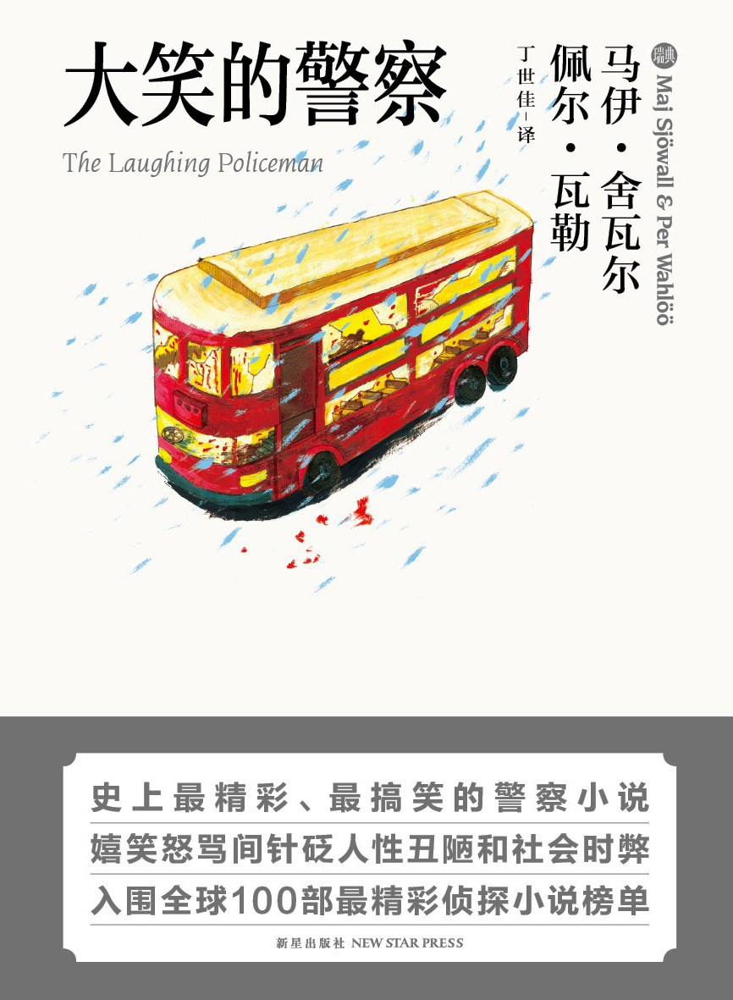

记录一下看完的图，算是打卡一样的自我激励吧！以后要多多看书。

书名：大笑的警察

作者：[瑞典]马伊·舍瓦尔、佩尔·瓦勒

<!--more-->

之前买的图书盲盒中的一本，新星出版社出版的口袋本。封面上写是最搞笑的警察小说，从开头一个警察的死亡就开始疑惑，主角是警察，他看到同事的死亡怎么能搞笑的起来呢？看完后去[豆瓣](https://book.douban.com/subject/5483041/)看评论，为数不多的评论里有很多一样的困惑。

不过书还是很好看的，很适合拍成电影。从一开始一筹莫展，都书最后几章终于步入探案的正规。看到后面时回头想前面几章，感觉几乎算得上毫无进展。

凶手看起来光鲜亮丽，一副高高在上的样子，被杀列表top1是一直信赖他的朋友，“他是一个好孩子”，看到这句话真想吐。而除了top2的警察，其他被害者可以说是无妄之灾，“最好只有一个无关人员”，“很不幸不止一个，所以我要全杀了”，人命是他摆脱嫌疑的工具而已。我约炮嫖娼我杀人但我是个好丈夫，你们都要为我的幸福生活让路。看完甚至在想，这人精神不好，不会开个精神病证明就能无罪了吧？剧情没有说，希望所有的坏人都能被绳之以法。